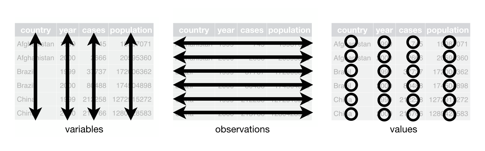
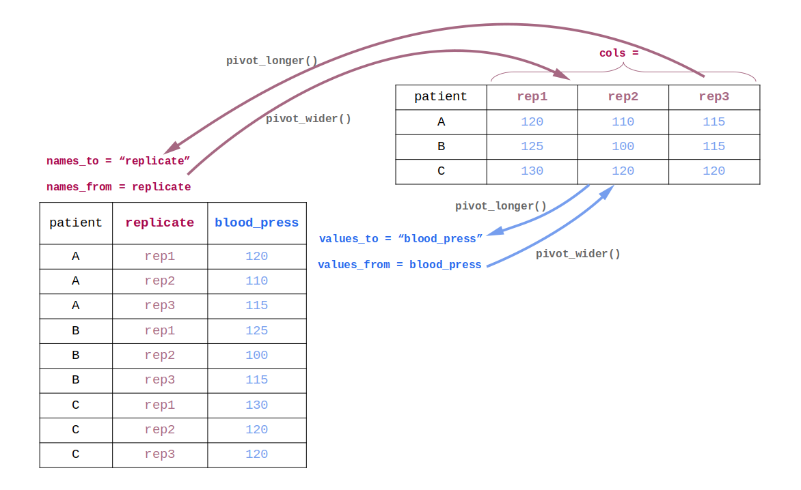
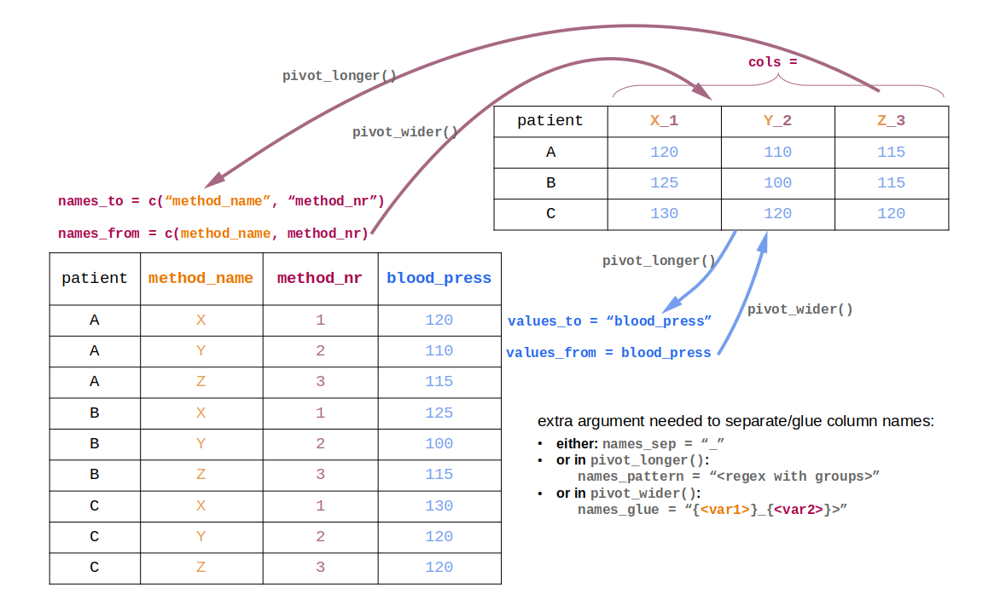
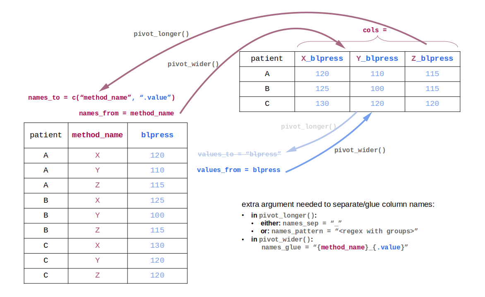
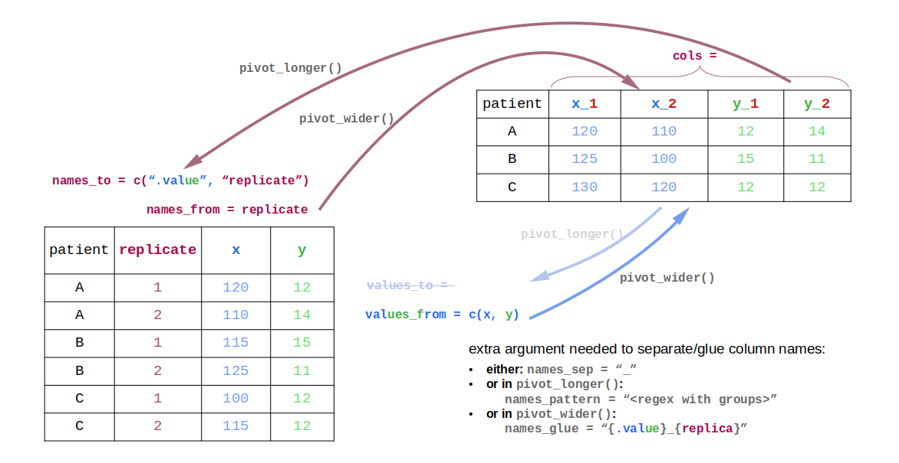

```{r, include=FALSE}
library(tidyverse)
```

## **Learning objectives:**

-   Classify datasets as **tidy** or **non-tidy.**
-   **Pivot** data to make it tidy.
-   Recognize reasons for **non-tidy data**.

Apart from the book content, these slides also borrow from [`vignette("pivot", "tidyr")`](https://tidyr.tidyverse.org/articles/pivot.html) and contain some new diagrams.

## Tidy data: what? {.unnumbered}



-   **variables** are the **columns**
-   **observations** are the **rows**
-   **values** are the **cells**

**`<meaningful things>`** are in **`<places>`**

## Tidy data: why? {.unnumbered}

-   packages in the **tidyverse** are designed to work with **tidy data**
    -   hence tidy data allow to focus on the data questions
-   placing variables in **columns** allows to take advantage of R’s **vectorized** nature

## An example (1) {.unnumbered}

```{r include=FALSE}
table0 <- table1 |>
  pivot_wider(
    names_from = year,
    values_from = c(cases, population),
  )
```

```{r}
table0
```

## An example (2) {.unnumbered}

```{r}
table1
```

## An example (3) {.unnumbered}

```{r}
table2
```

## Which example dataframe was tidy? {.unnumbered}

## Which example dataframe was tidy? {.unnumbered}

```{r}
table1
```

## The challenge (1) {.unnumbered}

-   most real data is **untidy**: to facilitate some goal other than analysis
-   so you often need to **tidy** the original data. This takes two steps:
    1.  determine the underlying variables and observations
    2.  pivot your data into a tidy form

## The challenge (2) {.unnumbered}

It may be difficult to define what a variable is, especially if you miss context.

-   e.g. columns `measurement_1` and `measurement_2`: replicates of the same variable, or referring to different methods / states?

If you cannot figure out, then it’s fine to say a variable is whatever makes your **analysis** easiest.

## Two different scenarios (1) {.unnumbered}

1.  'too wide' is most common: *values* (of a variable) have ended up *in **column names***
    -   tidy by making the data **longer**: pivot these values into their own column (variable)

## Too wide {.unnumbered}

```{r}
table4a # only has the 'cases', not the 'population'
```

## Two different scenarios (2) {.unnumbered}

1.  'too wide' is most common: *values* (of a variable) have ended up *in **column names***
    -   tidy by making the data **longer**: pivot these values into their own column (variable)
2.  'too long' is less common: *names* of several variables exist as ***cells in one column***, their values in another
    -   tidy by making the data **wider**: pivot the column with variable names into several columns (variables)

## Too long {.unnumbered}

```{r}
table2
```

## Tidy your data (1) {.unnumbered}

-   Make too wide data **longer** with `tidyr::pivot_longer()`.
-   Make too long data **wider** with `tidyr::pivot_wider()`.

We'll focus on the relationship between both functions in different situations.

## Tidy your data (2) {.unnumbered}

Most function arguments contain the strings `names` or `values`:

-   **`names`**: refers to **variable** whose *values* generate **column names** in **wide** table
-   **`values`**: refers to **variable** whose *values* generate **cells** in **wide** table

These arguments always get the **name** of the corresponding variable in the **long** table!

## 1. One `names` variable and one `values` variable {.unnumbered}



## Example {.unnumbered}

::::: {style="display: flex;"}
::: {style="margin-right: 0.5em; width: 50%;"}
**Non-tidy:**

```{r}
table4a
```
:::

::: {style="margin-left: 0.5em; width: 50%;"}
**Tidy:**

```{r}
table_tidy <- 
  table4a |> 
  pivot_longer(
    cols = !country,
    names_to = "year",
    values_to = "cases"
  )
table_tidy
```
:::
:::::

## 2. Multiple `names` variables and one `values` variable {.unnumbered}



## Example {.unnumbered}

```{r include=FALSE}
perc_wide <- tibble(
  "2018_A" = 100, 
  "2018_B" = 0, 
  "2019_A" = 0, 
  "2019_B" = 100, 
  "2020_A" = 40, 
  "2020_B" = 60
)
```

::::: {style="display: flex;"}
::: {style="margin-right: 0.5em; width: 50%;"}
**Non-tidy:**

```{r}
perc_wide[,1:4]
```
:::

::: {style="margin-left: 0.5em; width: 50%;"}
**Tidy:**

```{r}
perc_tidy <- perc_wide |> 
  pivot_longer(
    cols = everything(),
    names_to = c("year", "type"),
    names_sep = "_",
    values_to = "percentage"
  )
perc_tidy
```
:::
:::::

## Pivot Back to Un-tidy

```{r}
perc_tidy |> 
  pivot_wider(
    names_from = c(year, type),
    names_sep = "_",
    values_from = percentage
  )
```

## Intermezzo: missing values (1) {.unnumbered}

**Non-tidy:**

```{r}
billboard
```

## Intermezzo: missing values (1) {.unnumbered}

**Tidy:**

```{r}
billboard %>% 
  pivot_longer(
    cols = starts_with("wk"), 
    names_to = "week", 
    values_to = "rank"
  )
```

## Intermezzo: missing values (2) {.unnumbered}

Notice the effect of `values_drop_na` in `pivot_longer()`!

```{r}
billboard %>% 
  pivot_longer(
    cols = starts_with("wk"), 
    names_to = "week", 
    values_to = "rank",
    values_drop_na = TRUE
  )
```

## Intermezzo: missing values (3) {.unnumbered}

Remember this example:

```{r}
perc_tidy
```

```{r}
perc_wide
```

## Intermezzo: missing values (4) {.unnumbered}

Suppose we have this, and you want to make it **wide** and add **zeros**, not `NA`s:

```{r include=FALSE}
percentages <- tibble(
  year = c(2018, 2019, 2020, 2020),
  type = factor(c("A", "B", "A", "B"), levels = c("A", "B")),
  percentage = c(100, 100, 40, 60)
)
```

```{r}
percentages
```

## Intermezzo: missing values (7) {.unnumbered}

Notice the effect of `names_expand` and `values_fill` in `pivot_wider()`!

```{r}
percentages |>
  pivot_wider(
    names_from = c(year, type),
    values_from = percentage,
    names_expand = TRUE,
    values_fill = 0
  )
```

## Recap {.unnumbered}

So far we had:

1.  One `names` variable and one `values` variable
2.  Multiple `names` variables and one `values` variable

Plus tricks to generate missing values or deal with them.

Let's consider two more situations:

3.  The `values` variable's name is included in the wide-table's column names
4.  Multiple `values` variables' names are included in the wide-table's column names

## 3. The `values` variable's name is included in the wide-table's column names {.unnumbered}



## Example {.unnumbered}

We take the example from the first situation, but with the name of the `values` variable included in the wide table:

```{r include=FALSE}
cases <- table_tidy |> 
  pivot_wider(
    names_from = year,
    values_from = cases,
    names_glue = "{.value}_{year}"
  )
```

```{r}
cases
```

## Example Cont. {.unnumbered}

We can now extract this name *instead* of defining it with `values_to`:

```{r}
cases_long <- cases |> 
  pivot_longer(
    cols = !country,
    names_to = c(".value", "year"),
    names_sep = "_"
  )
cases_long
```

## 4. Multiple `values` variables' names are included in the wide-table's column names {.unnumbered}



## Example {.unnumbered}

```{r}
household
```

## Example Cont. {.unnumbered}

```{r}
household_tidy <- household |>
  pivot_longer(
    cols = !family,
    names_to = c(".value", "child"),
    names_sep = "_",
    values_drop_na = TRUE
  )
household_tidy
```

## There's more! {.unnumbered}

See [book chapter](https://r4ds.hadley.nz/data-tidy) and especially the [vignette](https://tidyr.tidyverse.org/articles/pivot.html)!

-   drop or add a (wide-table) column name prefix with the `names_prefix` argument
-   drop 'id' columns (i.e. non-pivoted columns) in `pivot_wider()` with the `id_cols` argument
-   generate rows with missing values in `pivot_wider()` with the `id_expand` argument
-   aggregating values in `pivot_wider()`
-   combining `pivot_longer()` and `pivot_wider()` for more complex situations
-   for more complex cases, instead of `names_*` and `values_*` arguments, you can construct a single specification dataframe that you can provide to both `pivot_longer_spec()` and `pivot_wider_spec()`
-   and more
