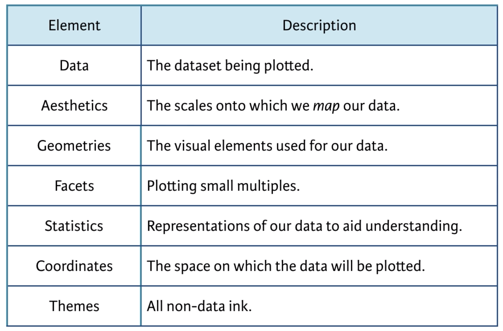
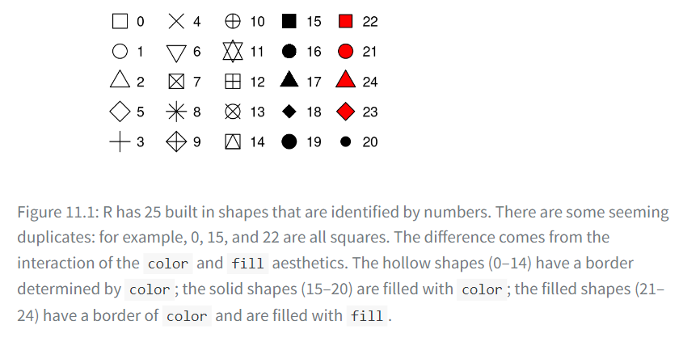

```{r}
#| echo: false
library(tidyverse)
```

## **Learning objectives**

-   We are going to learn about the layered grammar of graphics, including:

    -   using aesthetics and geometries to build plots;

    -   aesthetic options and rules;

    -   data as a local option

## Introduction



## Aesthetic mappings

-   We will be working with the `mpg` data frame that is bundled with the ggplot2 package which contains 234 observations collected by the US Environmental Protection Agency on 38 car models. Among the variables in `mpg` are:

    \-`displ`: A car’s engine size, in liters. A numerical variable.

    \-`hwy`: A car’s fuel efficiency on the highway, in miles per gallon (mpg). A car with a low fuel efficiency consumes more fuel than a car with a high fuel efficiency when they travel the same distance. A numerical variable.

    \-`class`: Type of car. A categorical variable.

## Categorical variables as aesthetics

-   Let’s start by visualizing the relationship between `displ` and `hwy` for various `class`es of cars

:::::: {style="display: flex;"}
::: {style="margin-right: 0.5em; width: 50%;"}
```{r}
#| echo: false
par(mar = c(4, 4, .1, .1))
```

```{r}
ggplot(mpg, aes(x = displ, y = hwy, 
                color = class))+
geom_point()
```
:::

::: {style="margin-left: 0.5em; width: 50%;"}
```{r}
ggplot(mpg, aes(x = displ, y = hwy, 
                shape = class))+
geom_point()
```
:::

::: notes
By default ggplot2 will only use six shapes at a time so additional groups will go unplotted when you use the shape aesthetic. There are 62 SUVs in the dataset and they’re not plotted.
:::
::::::

## Categorical variables as aesthetics

-   Similarly, we can map `class` to `size` or `alpha` (transparency) aesthetics as well.

:::::: {style="display: flex;"}
::: {style="margin-right: 0.5em; width: 50%;"}
```{r}
#| echo: false
par(mar = c(4, 4, .1, .1))
```

```{r}
ggplot(mpg, aes(x = displ, y = hwy, 
                size = class))+
geom_point()
```
:::

::: {style="margin-left: 0.5em; width: 50%;"}
```{r}
ggplot(mpg, aes(x = displ, y = hwy, 
                alpha = class))+
geom_point()
```
:::

::: notes
We get warnings because mapping a non-ordinal discrete variable (`class`) to an ordered aesthetic (`size` or `alpha`) is generally not a good idea because it implies a ranking that does not in fact exist.
:::
::::::

## Mapping categorical variables to aesthetics cont.

-   Once you map an aesthetic, ggplot2 takes care of the rest by
    -   selecting a reasonable scale to use with the aesthetic,
    -   and it constructing a legend that explains the mapping between levels and values.
-   For x and y aesthetics, ggplot2 does not create a legend, but it creates an axis line with tick marks and a label.
    -   The axis line acts as a legend; it explains the mapping between locations and values.

## Manually setting aesthetic properties

-   We can also set the aesthetic properties of your geom manually. For example, we can make all of the points in our plot blue.
-   The color doesn't convey information about a variable, but only changes the appearance of the plot.

```{r}
ggplot(mpg, aes(x = displ, y = hwy)) + 
  geom_point(color = "blue")
```

## Manually setting aesthetic properties

-   When manually setting aesthetic properties, we need to pick a value that makes sense for that aesthetic:
    -   The name of a color as a character string, e.g., color = "blue"
    -   Notice this is a ***local aesthetic*** when it is not based on a variable
    -   The size of a point in mm, e.g., size = 1
    -   We can learn more about aesthetics mapping by looking at this vignettes [**aesthetic specifications vignette**](https://ggplot2.tidyverse.org/articles/ggplot2-specs.html)

## Shape Map

-   The shape of a point as a number, e.g, shape = 1, as shown below.



## Note about Geometric objects

-   ggplot2 provides more than 40 geoms but these don’t cover all possible plots one could make. If you need a different geom, we recommend looking into extension packages first to see if someone else has already implemented it [**here**](https://exts.ggplot2.tidyverse.org/gallery/)

-   The best place to get a comprehensive overview of all of the geoms ggplot2 offers, as well as all functions in the package, is the reference page:[**ggplot2-reference page**](https://ggplot2.tidyverse.org/reference)

## Data as a local option

-   We can also specify different data for different layer.

```{r}
#| code-line-numbers: 1,2,3,4,5,6,7,8,9,10|3,4,5,6|7,8,9,10
ggplot(mpg, aes(x = displ, y = hwy)) + 
  geom_point() + 
  geom_point(
    data = mpg |> filter(class == "2seater"), 
    color = "red"
  ) +
  geom_point(
    data = mpg |> filter(class == "2seater"), 
    shape = "circle open", size = 3, color = "red"
  )
```

## Resources

-   Two very useful resources for getting an overview of the complete ggplot2 functionality are the [ggplot2 cheatsheet](https://posit.co/resources/cheatsheets) and the [ggplot2 package website](https://ggplot2.tidyverse.org).
-   [ggplot2 Extension Gallery](https://exts.ggplot2.tidyverse.org/gallery/)
-   [R Graph Gallery](https://www.r-graph-gallery.com/ggplot2-package.html)
-   The [Graphs section](http://www.cookbook-r.com/Graphs/) of the R Cookbook
-   [dslc.io/join](dslc.io/join) for more book clubs!

## 
