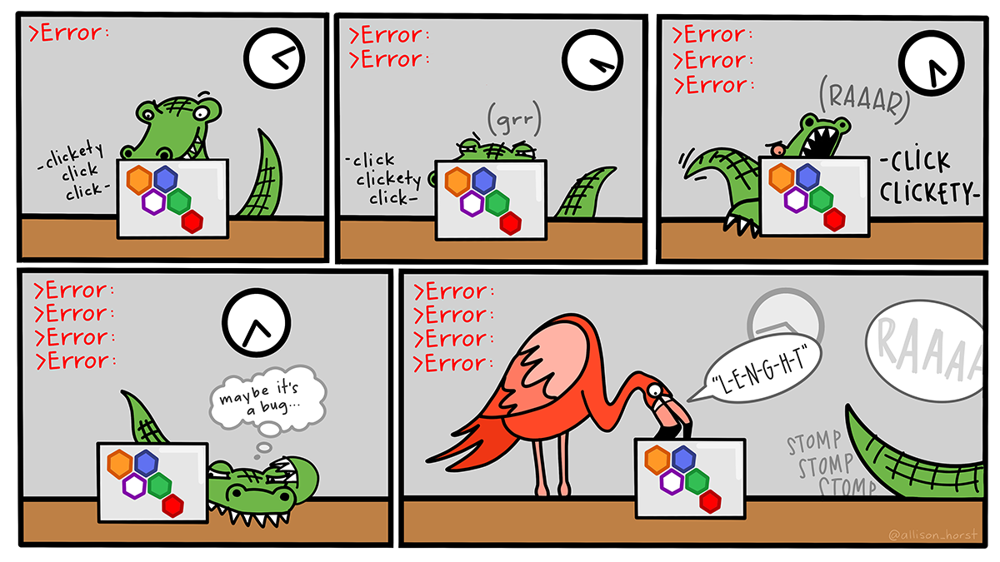

## Learning objectives:

::::: {style="display: flex;"}
<div>

-   Produce a simple plot with `ggplot2`
-   Use different **`aes`thetic mappings** and **`geom_*()` functions** to produce more complex plots
-   Visualize **distributions and relationships** in data
-   Produce **small multiples** with `facet()`
-   [Make the plot to the right](https://r4ds.hadley.nz/data-visualize_files/figure-html/unnamed-chunk-7-1.png)

</div>

<div>


</div>
:::::

## Loading Packages in R {.unnumbered}

-   `install.packages("Package_name")` to **install** a package.
    -   Before 1st use, but only once
    -   Packages you need may already be installed
-   `library(Package_name)` to **load** a package.
    -   In general, do this at start of session
-   Alternatively: `ggplot2::ggplot()`.
    -   "ggplot2" = package, "ggplot()" = function

## Loading Packages in R {.unnumbered}

We use the `library()` function to load packages in `r`

```{r 02-otherpkgs}
#| code-line-numbers: "1|2|3"
library(tidyverse)
library(palmerpenguins)
library(ggthemes)
```

## Peeking at the `palmerpenguins` {.unnumbered}

```{r 02-dataset}
palmerpenguins::penguins
```

## Creating a ggplot: ggplot() {.unnumbered}

-   Call `ggplot()` function.
-   Arguments:
    -   **data** to use
    -   how to **map** them to **aesthetics**

## Basic code format: ggplot() {.unnumbered}

```{r }
#| code-line-numbers: "1,4|2|3|5"
ggplot(
  data = penguins,
  mapping = aes(x = flipper_length_mm, y = body_mass_g)
)
```

## Creating a ggplot: geom\_\*() {.unnumbered}

```{r 02-plot02}
#| code-line-numbers: "5"
ggplot(
  data = penguins,
  mapping = aes(x = flipper_length_mm, y = body_mass_g)
) +
  geom_point()
```

## Adding Aesthetics and Layers {.unnumbered}

-   **Aesthetics** = visual properties of the plot.

-   More aesthetics may tell the data's story better.

```{r}
#| code-line-numbers: "3"
#| eval: false
ggplot(
  data = penguins,
  mapping = aes(x = flipper_length_mm, y = body_mass_g)
) +
  geom_point()
```

## Adding Aesthetics and Layers {.unnumbered}

-   Types of **aesthetic mapping**:

    |             |     |                        |
    |-------------|-----|------------------------|
    | **X and Y** |     | linetype and linewidth |
    | stroke      |     | shape                  |
    | **color**   |     | **fill**               |
    | **group**   |     | alpha (trasparency)    |
    | show.legend |     | others                 |

## Adding Aesthetics and Layers {.unnumbered}

```{r 02-plot03, message=FALSE, warning=FALSE}
#| code-line-numbers: "3,4,5,6,7|4|5|6|7"
ggplot(
  data = penguins,
  mapping = aes(
    x = flipper_length_mm, 
    y = body_mass_g, 
    color = species
  )
) +
  geom_point()
```

## Adding Layers {.unnumbered}

-   Additional `geom_*()` layers may help as well

```{r 02-plot04, message=FALSE, warning=FALSE}
#| code-line-numbers: "5|6"
ggplot(
  data = penguins,
  mapping = aes(x = flipper_length_mm, y = body_mass_g, color = species)
) +
  geom_point() +
  geom_smooth(method = "lm")
```

## Types of Layers {.unnumbered}

-   `geom_*()` functions available:
    -   point (scatterplot)
    -   line
    -   smooth (curve)
    -   histogram / bar or (stat_count) / col
    -   boxplot
    -   map
    -   text / label
    -   ...

## Global vs. Local Aesthetics {.unnumbered}

::::: {style="display: flex;"}
::: {style="margin-right: 0.5em; width: 50%;"}
**Global aesthetics:**

-   in `ggplot()`
-   apply to all layers

```{r 02-plot05, message=FALSE, warning=FALSE}
#| code-line-numbers: "3,4,5,6,7|6"
#| eval: false
ggplot(
  data = penguins,
  mapping = aes(
    x = flipper_length_mm, 
    y = body_mass_g, 
    color = species
  )
) +
  geom_point() +
  geom_smooth(method = "lm")
```
:::

::: {style="margin-left: 0.5em; width: 50%;"}
**Local aesthetics:**

-   in `geom_*()`
-   apply only to that layer.

```{r 02-plot06, message=FALSE, warning=FALSE}
#| code-line-numbers: "3,4,5,6|9"
#| eval: false
ggplot(
  data = penguins,
  mapping = aes(
    x = flipper_length_mm, 
    y = body_mass_g
  )
) +
  geom_point(
    aes(color = species)) +
  geom_smooth(method = "lm")
```
:::
:::::

## Global vs. Local Aesthetics {.unnumbered}

::::: {style="display: flex;"}
::: {style="margin-right: 0.5em; width: 50%;"}
**Global aesthetics:**

-   in `ggplot()`
-   apply to all layers

```{r 02-plot05b, message=FALSE, warning=FALSE}
#| echo: false
#| code-line-numbers: "3,4,5,6,7|6"
ggplot(
  data = penguins,
  mapping = aes(
    x = flipper_length_mm, 
    y = body_mass_g, 
    color = species
  )
) +
  geom_point() +
  geom_smooth(method = "lm")
```
:::

::: {style="margin-left: 0.5em; width: 50%;"}
**Local aesthetics:**

-   in `geom_*()`
-   apply only to that layer.

```{r 02-plot06b, message=FALSE, warning=FALSE}
#| echo: false
#| code-line-numbers: "3,4,5,6|9"
ggplot(
  data = penguins,
  mapping = aes(
    x = flipper_length_mm, 
    y = body_mass_g
  )
) +
  geom_point(
    aes(color = species)) +
  geom_smooth(method = "lm")
```
:::
:::::

## Improving Accessibility {.unnumbered}

-   Mapping shape and color may help colorblind readers
-   Colorblind-friendly palette would help, too

```{r 02-plot07, message=FALSE, warning=FALSE}
#| code-line-numbers: "7"
#| eval: false
ggplot(
  data = penguins,
  mapping = aes(x = flipper_length_mm, y = body_mass_g)
) +
  geom_point(aes(color = species, shape = species)) +
  geom_smooth(method = "lm") +
  scale_color_colorblind()

```

## Non-colorblind vs Colorbling {.unnumbered}

::::: {style="display: flex;"}
::: {style="margin-right: 0.5em; width: 50%;"}
**Non-colorblind compatible:**

```{r 02-plot07b, message=FALSE, warning=FALSE}
#| echo: false
#| code-line-numbers: "3,4,5,6|9"
ggplot(
  data = penguins,
  mapping = aes(
    x = flipper_length_mm, 
    y = body_mass_g
  )
) +
  geom_point(
    aes(color = species)) +
  geom_smooth(method = "lm")
```
:::

::: {style="margin-left: 0.5em; width: 50%;"}
**Colorblind accessible:**

```{r 02-plot07c, message=FALSE, warning=FALSE}
#| code-line-numbers: "7"
#| echo: false
ggplot(
  data = penguins,
  mapping = aes(x = flipper_length_mm, y = body_mass_g)
) +
  geom_point(aes(color = species, shape = species)) +
  geom_smooth(method = "lm") +
  scale_color_colorblind()
```
:::
:::::

## Why Stop There? {.unnumbered}

Use `labs()` to add understandable titles and axes.

```{r 02-plot08, message=FALSE, warning=FALSE}
#| eval: false
#| code-line-numbers: "7,8,9,10,11,12|8|9|10|11"
ggplot(
  data = penguins,
  mapping = aes(x = flipper_length_mm, y = body_mass_g)
) +
  geom_point(aes(color = species, shape = species)) +
  geom_smooth(method = "lm") +
  labs(
    title = "Body mass and flipper length",
    subtitle = "Dimensions for Adelie, Chinstrap, and Gentoo Penguins",
    x = "Flipper length (mm)", y = "Body mass (g)",
    color = "Species", shape = "Species"
  ) +
  scale_color_colorblind()
```

## Why Stop There? {.unnumbered}

Use `labs()` to add understandable titles and axes.

```{r 02-plot08b, message=FALSE, warning=FALSE}
#| echo: false
#| code-line-numbers: "7,8,9,10,11,12|8|9|10|11"
ggplot(
  data = penguins,
  mapping = aes(x = flipper_length_mm, y = body_mass_g)
) +
  geom_point(aes(color = species, shape = species)) +
  geom_smooth(method = "lm") +
  labs(
    title = "Body mass and flipper length",
    subtitle = "Dimensions for Adelie, Chinstrap, and Gentoo Penguins",
    x = "Flipper length (mm)", y = "Body mass (g)",
    color = "Species", shape = "Species"
  ) +
  scale_color_colorblind()
```

## `ggplot2` calls {.unnumbered}

-   For brevity, "data =" and "mapping =" often dropped
-   But things still work...

```{r 02-twin02, message=FALSE, warning=FALSE}
#| code-line-numbers: "1"
ggplot(penguins, aes(x = flipper_length_mm, y = body_mass_g)) + 
  geom_point()
```

## Visualizing Distributions: Barplots {.unnumbered}

-   Quickly check out variable distributions.

-   Barplots help with categorical variables.

```{r 02-categorical, message=FALSE, warning=FALSE}
#| code-line-numbers: "1|2"
ggplot(penguins, aes(x = species)) +
  geom_bar()
```

## Visualizing Distributions: Histograms {.unnumbered}

-   Histograms aid with numerical variables

```{r 02-numerical, message=FALSE, warning=FALSE}
#| code-line-numbers: "1|2"
ggplot(penguins, aes(x = body_mass_g)) +
  geom_histogram(binwidth = 200)
```

## Visualizing Distributions: Density plots {.unnumbered}

-   Density plots also help

```{r 02-numerical2, message=FALSE, warning=FALSE}
#| code-line-numbers: "1|2"
ggplot(penguins, aes(x = body_mass_g)) +
  geom_density()
```

## Visualizing relationships {.unnumbered}

`ggplot2` is also incredible at displaying relationships between variables.

## Numerical Variable and Categorical Variable {.unnumbered}

-   Boxplots help here (or color-coded density plots).

```{r 02-relationship-boxplot, message=FALSE, warning=FALSE}
#| code-line-numbers: "1|2"
ggplot(penguins, aes(x = species, y = body_mass_g)) +
  geom_boxplot()
```

## Two Categorical Variables {.unnumbered}

-   Try a bar plot.
-   Why use fill here? Why not color?

```{r 02-relationship-bar, message=FALSE, warning=FALSE}
#| code-line-numbers: "1|2"
ggplot(penguins, aes(x = island, fill = species)) +
  geom_bar()
```

## Two Categorical Variables {.unnumbered}

-   To get proportions, set `position` argument to "fill"

```{r 02-relationship-barprop, message=FALSE, warning=FALSE}
#| code-line-numbers: "2"
ggplot(penguins, aes(x = island, fill = species)) +
  geom_bar(position = "fill")
```

## Two Numerical Variables {.unnumbered}

-   Scatterplots shine here.

```{r 02-relationship-scatter, message=FALSE, warning=FALSE}
#| code-line-numbers: "1|2"
ggplot(penguins, aes(x = flipper_length_mm, y = body_mass_g)) +
  geom_point()
```

## Three or More Variables {.unnumbered}

-   Map aesthetics to different variables

```{r 02-relationship-scatter-multi, message=FALSE, warning=FALSE}
#| code-line-numbers: "1|2"
ggplot(penguins, aes(x = flipper_length_mm, y = body_mass_g)) +
  geom_point(aes(color = species, shape = island))
```

## Three or More Variables {.unnumbered}

-   Or use `facet_wrap()` to create "small multiples"

```{r 02-relationship-facet, message=FALSE, warning=FALSE}
#| code-line-numbers: "1,2|3"
ggplot(penguins, aes(x = flipper_length_mm, y = body_mass_g)) +
  geom_point(aes(color = species, shape = species)) +
  facet_wrap(~island)
```

## Saving Your Plots {.unnumbered}

-   `ggsave()` lets you get your plots out of R for sharing.
-   Setting `width` and/or `height` helps with reproducibility.

```{r 02-ggsave, eval=FALSE}
#| eval: false
#| code-line-numbers: "3,4,5,6"
ggplot(penguins, aes(x = flipper_length_mm, y = body_mass_g)) +
  geom_point()
ggsave(filename = "penguin-plot.png", width = 800, units = "px")
#> Saving 800 x 1983 px image
#> Warning message:
#> Removed 2 rows containing missing values (`geom_point()`). 
```

## Saving Your Plots {.unnumbered}

-   Changing filename in `ggsave()` to end in `.pdf` instead of `.png` will change the type. Looking at the function documentation, we see there are options for: "eps", "ps", "tex" (pictex), "pdf", "jpeg", "tiff", "png", "bmp", "svg" and "wmf" (windows only).

```{r 02-ggsaveb, eval=FALSE}
#| eval: false
#| code-line-numbers: "3"
ggplot(penguins, aes(x = flipper_length_mm, y = body_mass_g)) +
  geom_point()
ggsave(filename = "penguin-plot.png", width = 800, units = "px")
#> Saving 800 x 1983 px image
#> Warning message:
#> Removed 2 rows containing missing values (`geom_point()`). 
```

## Common Problems {.unnumbered}

Mistakes happen. To everyone.

Maybe it's a mismatched `()` or `""`.

Or a `+` in the wrong spot.

## Common Problems {.unnumbered}

But more than likely, you misspelled something.

[](https://allisonhorst.com/everything-else) [Art by Allison Horst](https://allisonhorst.com/everything-else/)

-   Read the error message for hints
-   Google error message
-   Look up documentation
-   Ask R friends
-   **Don't give up ... setbacks are temporary**

## Summary {.unnumbered}

:::: {style="display: flex;"}
-   Produce a simple plot with `ggplot2`
-   Use different **`aes`thetic mappings** and **`geom_*()` functions** to produce more complex plots
-   Visualize **distributions and relationships** in data
-   Produce **small multiples** with `facet()`
-   [Make the plot to the right](https://r4ds.hadley.nz/data-visualize_files/figure-html/unnamed-chunk-7-1.png)

<div>


</div>
::::

## Resources: {.unnumbered}

-   [R4DS book (1e)](https://r4ds.had.co.nz/data-visualisation.html)
-   [R for Data Science: Exercise Solutions (1e)](https://jrnold.github.io/r4ds-exercise-solutions/)
-   [A Layered Grammar of Graphics](http://vita.had.co.nz/papers/layered-grammar.pdf)
-   [{ggplot2}](https://cran.r-project.org/web/packages/ggplot2/index.html)
-   [ggplot2 extensions - gallery](https://exts.ggplot2.tidyverse.org/gallery/)
-   [R Graphics Cookbook](https://r-graphics.org/)
-   [Gina Reynolds' ggplot flipbook](https://evamaerey.github.io/ggplot_flipbook/ggplot_flipbook_xaringan.html)
