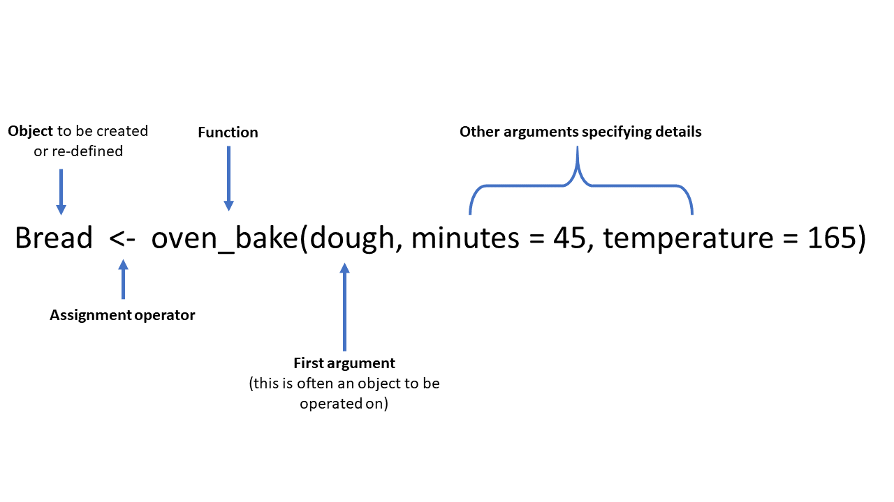

## **Learning objectives:**

-   Review some basic R coding.
-   Follow good **style conventions** when writing code.
-   Explain the importance of commenting your code.
-   Recognize good practices when naming objects.
-   Confidently call **functions** in R.

## Basic math calculations {.unnumbered}

R is, in its most basic form, a calculator.

```{r}
#| echo: true
1 / 200 * 30
(59 + 73 + 2) / 3
sin(pi / 2)
```

## Create new objects {.unnumbered}

1.  R is an object oriented programming language

2.  Objects are data structures that hold bits of information in computer memory that we can access by calling their name or 'passing' them to a function

3.  Objects can be referred to as variables in some cases

## Create new objects {.unnumbered}

Use the 'assignment operator' `<-` to create new objects

The general format is `name <- value`

-   Windows: 'ALT -'.

-   Mac: 'Option -'.

-   Pronunciation: `x <- 3*4`

    -   "to ... assign" or "is assigned to": "To object x ***assign*** three by four" OR "three by four ***is assigned to*** object x"
    -   "gets": "x ***gets*** 3 times 4".

## Create new objects: Reverse assign {.unnumbered}

Can go the other way `->`, eg graphs:

```{r}
#| echo: true
5 -> y
y
```

## Create new objects: Reverse assign {.unnumbered}

Can go the other way `->`, eg graphs:

```{r}
#| echo: true
5 -> y
y
```

**DO NOT DO THIS IN THIS CLASS!**

# Create new objects: Examples {.unnumbered}

## Basic Data Types: Numeric {.unnumbered}

```{r}
#| echo: true
x <- 5
x

y <- 7
y

x*y

z <- x+y
z

```

## Basic Data Types: Character {.unnumbered}

```{r}
#| echo: true
nm <- "Chad"
nm
```

## Complex Objects: Vectors {.unnumbered}

-   Created using the **c**ombine function `c()`

-   Individual elements can be accessed by location number

```{r}
#| echo: true
names <- c("Bob", "Mary", "Melissa", "Angela", "Felicia")
names

names[2]
```

## Combining elements {.unnumbered}

-   Combine elements into a vector with `c()`
-   Basic arithmetic operations applied to every element of a vector.

```{r}
#| echo: true
primes <- c(2, 3, 5, 7, 11, 13)
primes * 2
```

## Complex Objects: Graphs {.unnumbered}

```{r}
#| code-line-numbers: "2,3|5"
#| echo: true
library(ggplot2)
plot01 <- ggplot(mtcars, aes(wt, hp)) +
  geom_point()

plot01
```

::: notes
Line by line
:::

## Complex Objects: Functions Results {.unnumbered}

```{r}
#| echo: true
primes #from the chunk above
prmMean <- mean(primes)
prmMean
```

## Comments {.unnumbered}

Use `#` to insert comments in R.

```{r}
#| code-line-numbers: "1|5"
#| echo: true
# Create vector of primes 
primes <- c(2, 3)
primes

# Multiply primes by 2
primes * 2
```

::: notes
line by line
:::

## Comments: Why? {.unnumbered}

-   Commenting your own code can save (future) you & and collaborators time.
-   *Why* of your code, not the *how* or *what.*
    -   Bad: `# Changed default value to 0.9`
    -   Good: `# Increased smoothing parameter to better capture the trend in the data.`

## Assigning names {.unnumbered}

-   Names must start with a letter, contain letters, numbers, `_`, `.`.
-   Good style convention ➡️ more readable code.
-   Use descriptive names. Long names are ok!
-   Book recommends `snake_case` (see next slide).
-   I use `camelCase`
-   R is case-sensitive! And it can't read your mind.
-   Typos matter!

## Assigning names: Cases {.unnumbered}

```{r}
#| eval: false
#| code-line-numbers: "1|2|3|4"
#| echo: true
i_use_snake_case
otherPeopleUseCamelCase
some.people.use.periods
And_aFew.People_RENOUNCEconvention #anarchy
```

::: notes
line by line
:::

## Assigning names: Cases {.unnumbered}

```{r}
#| eval: false
#| echo: true
i_use_snake_case
otherPeopleUseCamelCase
some.people.use.periods
And_aFew.People_RENOUNCEconvention #anarchy
```

**What matters most is consistency and readability!**

# Functions

## Basic Function Structure {.unnumbered}

{width="895"}

## Calling Functions {.unnumbered}

-   Functions take in attributes and **return** results

-   Those results can be **assigned** into an object/variable for later use

-   Packages contain functions that have been written by others such as `ggplot()`, `geom_point()` , and `mean()`

-   There is overlap and many functions do the same things as other functions just with different and possibly faster implementations

## Calling Functions: Arguments {.unnumbered}

-   Can usually skip arg names, but can make code more readable.
-   Order of named args isn't important
-   If you skip names remember the order of the defined function.

```{r}
#| eval: false
#| echo: true
# All of these are equivalent
seq(from = 1,  to = 10)
seq(to = 10,  from = 1)
seq(1, 10)
#> [1]  1  2  3  4  5  6  7  8  9 10
```

## That's It! Have a great week! {.unnumbered}
