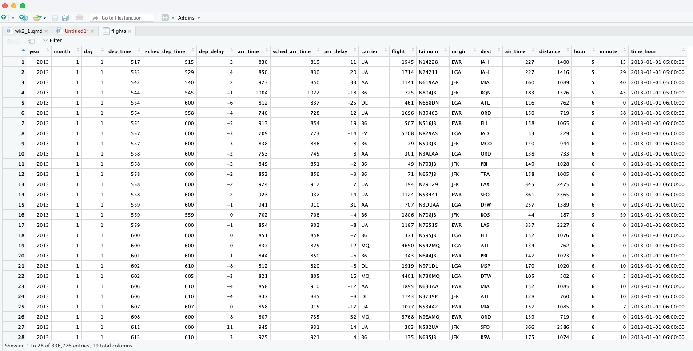

# Data transformation

## **Learning objectives:**

-   **Pick out rows** of a data frame with the **`dplyr::filter()`** function.
-   **Sort rows** of a data frame with **`dplyr::arrange()`**.
-   **Streamline data transformations** with the **pipe** operator (`|>`).

## Prerequisites {.unnumbered}

-   dplyr 📦 = functions to manipulate data frames.
-   data frames consist of columns (variables) and rows (observations).
-   dplyr is part of the tidyverse.

```{r}
#| eval: false
install.packages("tidyverse")
```

```{r}
library(tidyverse)
```

## Explore the nycflights13 data {.unnumbered}

`nycflights13` 📦 = New York City flight data from 2013.

```{r}
#| eval: false
install.packages("nycflights13")
```

```{r}
library(nycflights13)
```

## Explore the nycflights13 data: console {.unnumbered}

-   Vertical

```{r}
flights
```

## Explore the nycflights13 data: console {.unnumbered}

-   Horizontal

```{r}
glimpse(flights)
```

## Explore the nycflights13 data: spreadsheet {.unnumbered}

::::: {style="display: flex;"}
::: {style="margin-right: 0.5em; width: 50%;"}
```{r}
#| eval: false
#| echo: true
View(flights)
```
:::

::: {style="margin-left: 0.5em; width: 50%;"}

:::
:::::

## Explore the nycflights13 data: data size {.unnumbered}

-   Get the number of rows and columns

```{r}
#| eval: false
#| code-line-numbers: "1,2,3|5,6,7|9,10,11"
#| echo: true

# number of rows
nrow(flights)
#> [1] 336776

# number of columns
ncol(flights)
#> [1] 19

# number of rows and columns
dim(flights)
#> [1] 336776     19
```

## Explore the nycflights13 data: Column names {.unnumbered}

```{r}
names(flights)
```

## Tidyverse verbs

We tend to call the functions used to clean and manipulate date within the `tidyverse` verbs.

## dplyr basics: General structure {.unnumbered}

When using `dplyr`:

-   1st arg is always a data frame.
-   Subsequent args typically = columns to operate on, as variable names (without quotes).
-   Output is always a new data frame.

## dplyr basics: Pipe {.unnumbered}

-   `|>` = pipe symbol
-   Pronounced "and then"
-   Pipes data from one function into 1st arg of next

## dplyr basics: Pipe Example {.unnumbered}

```{r}
#| eval: false
#| code-line-numbers: "1|2|3|4,5,6"
flights |>
  filter(dest == "IAH") |> 
  group_by(year, month, day) |> 
  summarize(
    arr_delay = mean(arr_delay, na.rm = TRUE)
  )
```

## dplyr basics: Pipe Example Explainer {.unnumbered}

-   "Take the flights dataset,
-   ***and then*** filter the flights that have their destination (dest) as 'IAH',
-   ***and then*** group these filtered results by year, month, and day,
-   ***and then*** for each group, calculate the average arrival delay (arr_delay), ignoring the missing values."

# Rows

## Filter rows with filter() {.unnumbered}

-   `filter()` = pick out certain rows (observations)
-   `filter()` picks rows which evaluate to TRUE for all criteria.
-   1st arg = data frame
-   Subsequent args are logical expressions

```{r}
# all flights that departed more than 120 minutes (two hours) late
flights |> 
  filter(dep_delay > 120)

```

## Comparisons {.unnumbered}

-   `>` greater than
-   `>=` greater than or equal
-   `<` less than
-   `<=` less than or equal
-   `==` equal
-   `!=` not equal

## Logical operators {.unnumbered}

-   `&` and; all expressions must be true in order to return true
-   `|` or; one or more expressions must be true in order to return true; `|` is the key above the return key, not lowercase letter l.
-   `!` not; negate the expression

## Logical operators examples: AND {.unnumbered}

-   Not really necessary, the commas in a `filter()` statement act as AND statemnts

```{r}
# Flights that departed on January 1
flights |> 
  filter(month == 1 & day == 1)
```

## Logical operators examples: OR {.unnumbered}

```{r}
# Flights that departed in January or February
flights |> 
  filter(month == 1 | month == 2)

```

## In operator {.unnumbered}

-   `%in%` in; checks to see if the value is 'in' a list of values

```{r}
# A shorter way to select flights that departed in January or February
flights |> 
  filter(month %in% c(1, 2))

```

## Using filter to create a new data set

-   When filtered results are stored in a new variable we get a subset of our data set
-   Data that is rectangular/row and column format is called a **data frame** or **tibble.** I will say data frame or dataset for this class

```{r}
# Save the result of the filtering to a variable
jan1 <- flights |> 
  filter(month == 1 & day == 1)
# "jan1 gets flights and then filter where month is 1 and day is 1."

dim(flights) #size of the original data set
dim(jan1) #size of our subsetted data set
```

## Common mistakes {.unnumbered}

-   Mistake: Using `=` instead of `==`
    -   `filter()` tells you when this happens (read the errors!):

```{r}
#| eval: false
#| code-line-numbers: "2:7"
flights |> 
  filter(month = 1)
#> Error in `filter()`:
#> ! We detected a named input.
#> ℹ This usually means that you've used `=` instead of `==`.
#> ℹ Did you mean `month == 1`?
```

## Common mistakes {.unnumbered}

::::: {style="display: flex;"}
::: {style="margin-right: 0.5em; width: 50%;"}
**Mistake: Writing “or” statements like you would in English:**

```{r}
#| eval: false
#| code-line-numbers: "2,3,4"
flights |> 
  filter(month == 1 | 2)

```

Returns an empty dataset because the condition can never be true. Equivalent to `filter((month == 1)| TRUE)`
:::

::: {style="margin-left: 0.5em; width: 50%;"}
**OR has a very specific meaning in code**

Filter where month is 1 OR month is 2

```{r}
#| eval: false
#| code-line-numbers: "2,3"
flights |> 
  filter(month == 1 | month == 2)

```
:::
:::::

## Arrange rows with arrange() {.unnumbered}

-   `arrange()` changes order of rows
-   1st arg = data frame
-   Subsequent args = columns names to sort by
-   Default order = ascending (small to big)
-   `desc()` for descending order (big to small).

## Arrange rows with arrange()

Example:

```{r}
# Sort flights from most to least delayed
flights |> 
  arrange(desc(dep_delay))
```

## Arrange rows with arrange() {.unnumbered}

-   Can arrange by multiple variables

```{r}
#| code-line-numbers: "2"
flights |> 
  arrange(year, month, day, dep_time)
```

## Arrange rows with arrange() {.unnumbered}

```{r}
#| eval: false
#| code-line-numbers: "2"
flights |> 
  arrange(year, month, day, dep_time)
```

How it works:

-   Sort by year (early to late) then
    -   by month (early to late) then
        -   by day (early to late), then
            -   by time

## Distinct {.unnumbered}

-   `distinct()` = find unique rows in dataset
-   Operates on rows
-   Optional args: column names = find unique combos of values
-   Note: This looks at whole rows

```{r}
# Remove duplicate rows, if any
flights |> 
  distinct()
```

## Distinct

Find unique origin + destination pairs

```{r}
flights |> 
  distinct(origin, dest)
```

## Distinct {.unnumbered}

Keep other columns when filtering for unique rows

```{r}
flights |> 
  distinct(origin, dest, .keep_all = TRUE)
```

## Count

-   `count()` = number of occurrences
-   `sort = TRUE` to arrange in descending order of \# occurrences

```{r}
flights |>
  count(origin, dest, sort = TRUE)
```

#  {.unnumbered}
