```{r}
#| echo: false
#| message: false
#| warning: false
oldopt <- options(pillar.print_max = 4, pillar.print_min = 4)
library(nycflights13)
library(tidyverse)
```

## **Learning objectives:**

-   Identify keys to connect a pair of data frames
-   Use mutating and filtering joins to combine data
-   Understand how joins work and understand the output
-   Understand how various key matching conditions work

## What is a join? {.unnumbered}

-   Joining two data frames `x` and `y`: combinies the information from both data frames to create a new data frame, by **matching rows in `x` to rows in `y` based on one or more common variables** (keys)

## Types of joins

-   Joins can be classified by several criteria:
    -   is the information of data frame `y` included in the result? (mutating vs filtering joins)
    -   what happens with non-matching rows? (inner vs outer joins / semi-join vs anti-join)
    -   how are key matching conditions defined? (equality vs inequality vs no restrictions)

## Keys {.unnumbered}

Keys = the variables used to connect a pair of data frames in a join.

-   `x$key` must match `y$key` for a row in `x` to be matched to a row in `y`
-   **compound key**: key that consists of \> 1 variable

## Keys {.unnumbered}

Every join involves a **pair of keys**: one key in each data frame.

They typically play a different role depending on the data frame they belong to:

-   one is a data frame's **primary key**: the *variable* or the *set of variables* that ***uniquely identifies*** each observation
-   the other is called a **foreign key**:
    -   it *corresponds* to the primary key (same meaning, same number of variables)
    -   its values can be repeated

## Keys Visualized {.unnumbered}

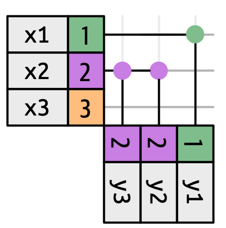

## Keys {.unnumbered}

Primary & foreign key relationships in the nycflights13 package:

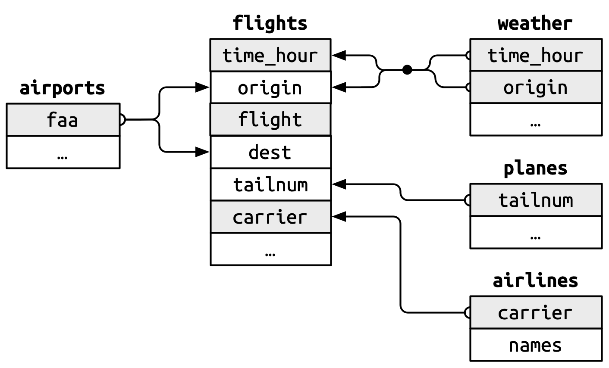

## Keys {.unnumbered}

Tips:

-   joining is easiest if primary and foreign key have the same name
-   check the primary keys!
    -   each value must occur only once
    -   there must be no missing values

## Mutating joins {.unnumbered}

**Mutating joins** add columns from data frame `y`.

-   Inner join: only keep matching rows.
-   Outer join: also keep non-matching rows from `x` (left join), `y` (right join) or both (full join).

## Mutating joins {.unnumbered}

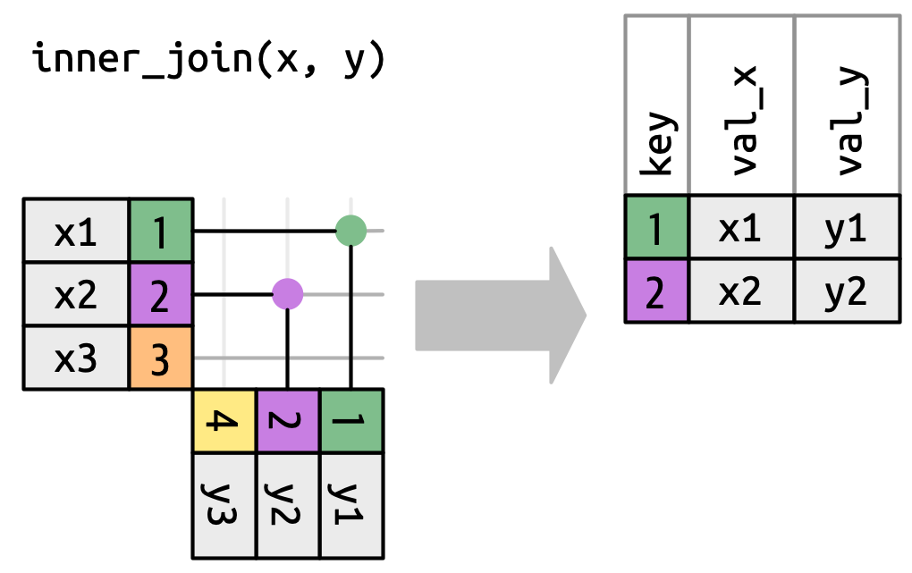

## Mutating joins {.unnumbered}

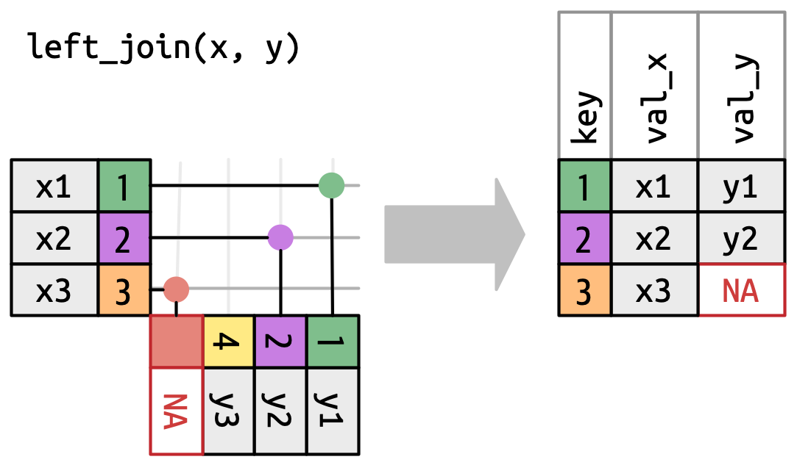

## Mutating joins {.unnumbered}

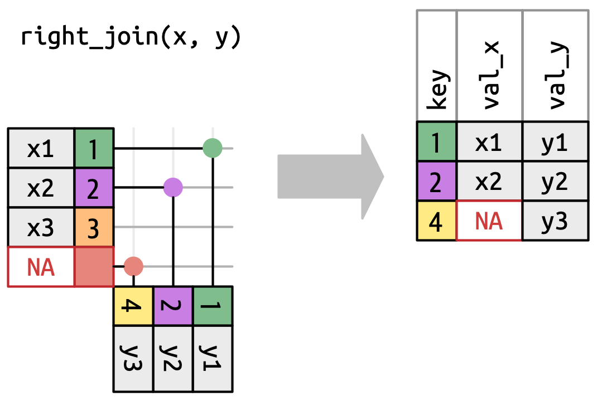

## Mutating joins {.unnumbered}

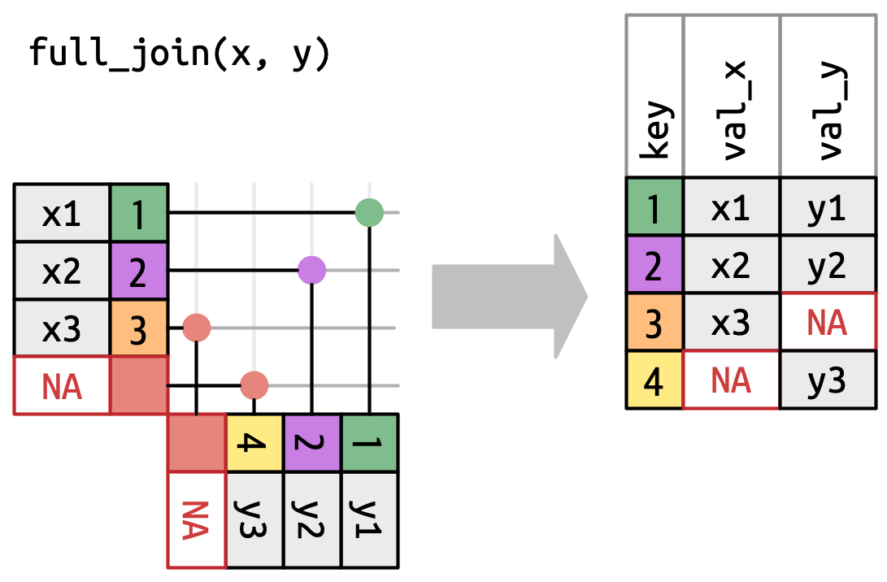

## Mutating joins: examples {.unnumbered}

```{r}
flights2 <- flights |> 
  select(year, time_hour, origin, dest, tailnum, carrier)
flights2
```

## Mutating joins: examples {.unnumbered}

```{r}
flights2 |>
  left_join(airlines)
```

## Mutating joins: examples {.unnumbered}

```{r}
flights2 |>
  inner_join(airlines)
```

## Relationships in mutating joins {.unnumbered}

The *relationship* describes how many rows in `x` we *expect* to match in `y$key` (**one** or **many**), *and vice-versa*, giving rise to 4 possible combinations:

-   one-to-many
-   many-to-one
-   one-to-one
-   many-to-many

Which relationship applies, follows from the keys being primary or foreign in `x` and `y`.

## Relationships in mutating joins {.unnumbered}

**One-to-many**: primary key is in `x`.

Example with left join:

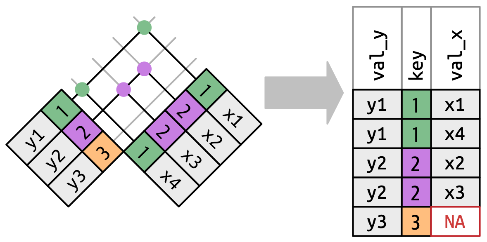

## Relationships in mutating joins {.unnumbered}

**Many-to-one**: primary key is in `y`.

Example with left join or inner join:

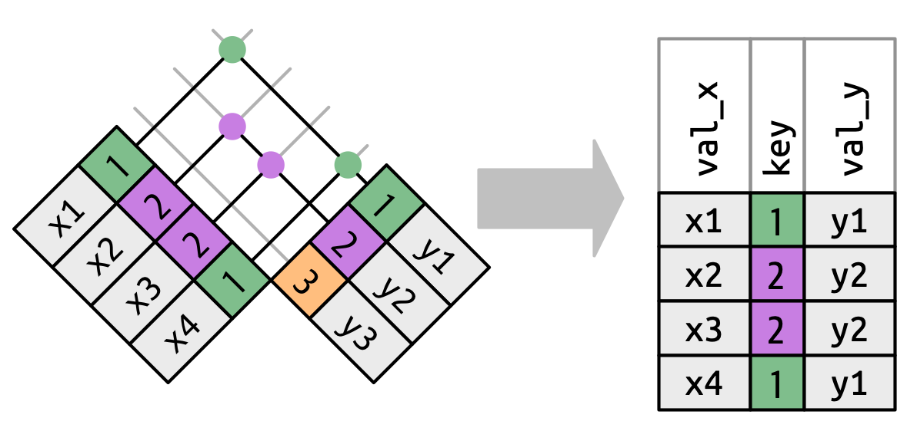

## Relationships in mutating joins {.unnumbered}

**One-to-one**: each row in `x` matches at most one row in `y`, and vice-versa.


## Relationships in mutating joins {.unnumbered}

**Many-to-many**: no primary keys involved!

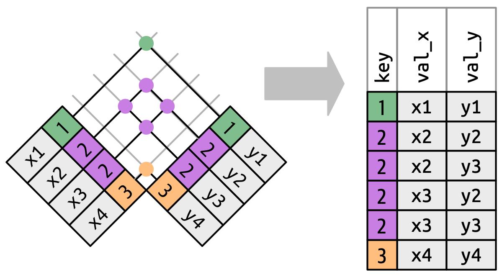

This gives a warning by default, since it can be unintended.

To avoid the warning (an intentional many-to-many), explicitly set `relationship = "many-to-many"`.

## Relationships in mutating joins {.unnumbered}

The `relationship` argument in mutating joins allows you to take control over the expected relationship.

From `help("mutate-joins")`:

> In production code, it is best to preemptively set `relationship` to whatever relationship you expect to exist between the keys of `x` and `y`, as this forces an error to occur immediately if the data doesn't align with your expectations.

## Filtering joins {.unnumbered}

**Filtering joins** filter `x` based on (non-)matching rows in `y`.

They never duplicate rows!

## Filtering joins {.unnumbered}

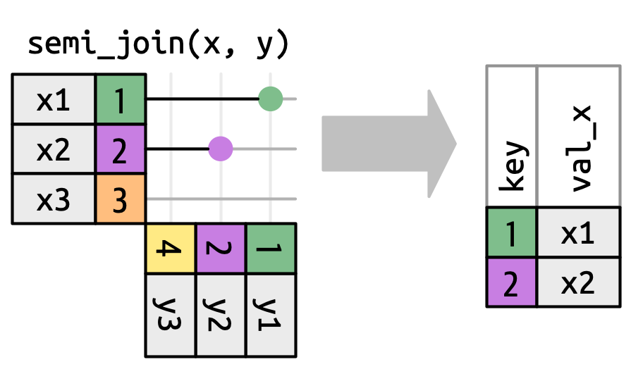

## Filtering joins {.unnumbered}

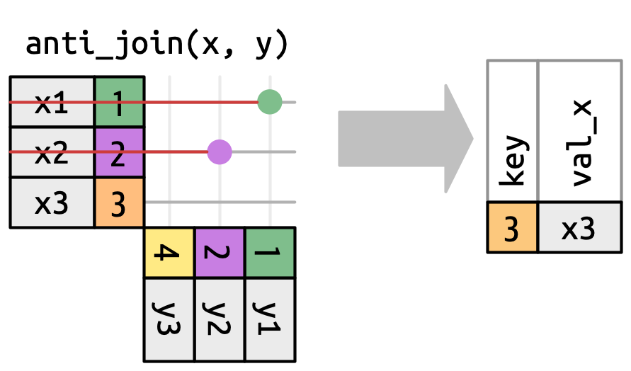

## Filtering joins: examples {.unnumbered}

```{r}
flights2 |>
  semi_join(weather)
```

## Filtering joins: examples {.unnumbered}

```{r}
flights2 |>
  anti_join(weather)
```

## Specifying join keys and their matching conditions {.unnumbered}

Without specifying a join key: the 'natural join' is applied (messages in previous slides).

BUT:

-   this will miss key pairs with different names
-   this will assume any pair of identical variable names to be part of the key pair

## Specifying join keys and their matching conditions {.unnumbered}

E.g. this is NOT what we intend (`year` has a different meaning in `flights` vs `planes`):

```{r}
flights2 |>
  left_join(planes)
```

## Specifying join keys and their matching conditions {.unnumbered}

So it's much recommended to explicitly define the join key using `join_by()`:

-   `inner_join(x, y, by = join_by(...))`
-   `left_join(x, y, by = join_by(...))`
-   `right_join(x, y, by = join_by(...))`
-   `full_join(x, y, by = join_by(...))`
-   `semi_join(x, y, by = join_by(...))`
-   `anti_join(x, y, by = join_by(...))`

## Specifying join keys and their matching conditions {.unnumbered}

When both keys have the same name(s): just provide the key name(s).

```{r}
flights2 |>
  left_join(planes, join_by(tailnum))
```

## Specifying join keys and their matching conditions {.unnumbered}

When both keys have the same name(s): just provide the key name(s).

```{r}
flights2 |>
  semi_join(weather, join_by(origin, time_hour))
```

## Specifying join keys and their matching conditions {.unnumbered}

`join_by(var1)` is shorthand for `join_by(var1 == var1)`.

`join_by(var1, var2)` is shorthand for `join_by(var1 == var1, var2 == var2)`.

The expression form in `join_by()` defines:

-   *each* key's name -- these can differ between the `x` and `y` data frame
-   the matching condition that defines the match between `x$key` and `y$key`: equality (`==`)

## Some `join_by()` examples {.unnumbered}

Join airport attributes without losing flights:

```{r}
flights2 |>
  left_join(airports, join_by(origin == faa))
```

## Some `join_by()` examples {.unnumbered}

Join airport attributes without losing flights:

```{r}
flights2 |>
  left_join(airports, join_by(dest == faa))
```
